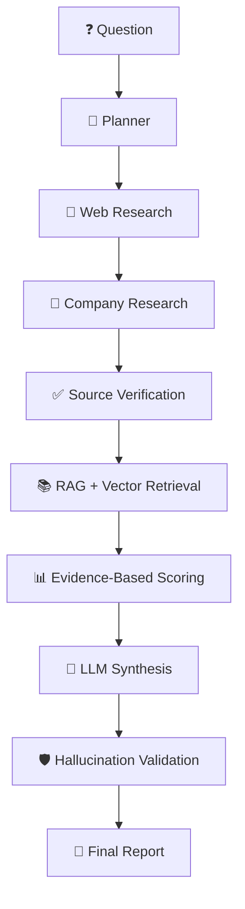

# 🤖 Agentic Research Intelligence Platform

### 🔬 From complex questions to structured, validated research reports

> An evidence-aware **Agentic AI research system** that turns complex research questions into structured, validated reports.

  
  
  
  
  
  
  

  
  
  
  

---

## 🚀 Overview

Unlike a basic **LLM → Answer** application, this project uses a multi-stage AI workflow:

| ❌ Basic LLM App | ✅ This Platform |
|:-:|:-:|
| Question → Answer | Plan → Research → Verify → Score → Validate |
| No evidence trail | Evidence-aware scoring |
| Unchecked output | Hallucination validation |

---

## ✨ Key Features

| | Feature | Details |
|:-:|---|---|
| 🧠 | **Agentic Workflow** | Built with LangGraph |
| 🔎 | **Web Research** | Powered by Tavily |
| 📚 | **RAG** | BGE-M3 embeddings |
| 🗄️ | **Semantic Retrieval** | PostgreSQL + pgvector |
| 🤖 | **Local LLM** | Qwen3 8B through Ollama |
| 📊 | **Company Scoring** | Evidence-aware |
| 🛡️ | **Validation** | Source verification & hallucination validation |
| 🎯 | **Confidence** | Evidence-based confidence scoring |
| 📈 | **Monitoring** | Token & latency tracking |
| ⚡ | **Interface** | FastAPI backend + Streamlit UI |
| 🧠 | **Memory / Cache** | Optional Redis |
| 🔬 | **Observability** | Optional Langfuse |

---

## 🛠️ Tech Stack

`Python` `LangGraph` `Qwen3` `Ollama` `RAG` `BGE-M3` `Tavily` `PostgreSQL` `pgvector` `Supabase` `FastAPI` `Streamlit` `Redis` `Langfuse` `Pydantic`

---

## 🎯 Example

> 💬 **"Analyze the Indian AI startup market and identify promising companies."**

The system plans the research, gathers evidence, retrieves relevant information, scores companies based on available evidence, generates a report, and validates the final output.

---

## 🔮 Future Improvements

- [ ] 🌐 Build a more advanced web interface
- [ ] 🔄 Add hybrid search and reranking
- [ ] 📊 Add retrieval evaluation metrics
- [ ] 🧠 Add stronger conversation history and memory
- [ ] 🐳 Dockerize the application
- [ ] ☁️ Deploy the application
- [ ] 🔗 Add richer source and citation tracking
- [ ] ⚙️ Improve asynchronous/background processing

---

⭐ **If you found this project interesting, consider giving it a star!** ⭐

